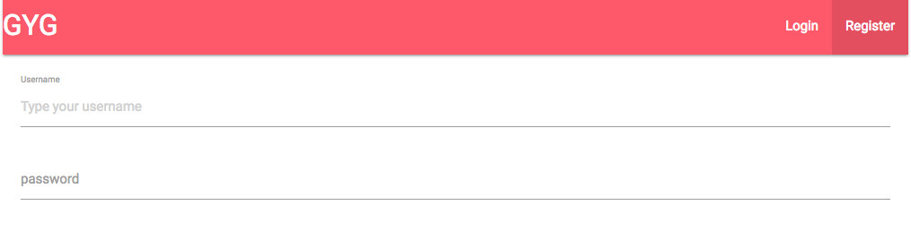
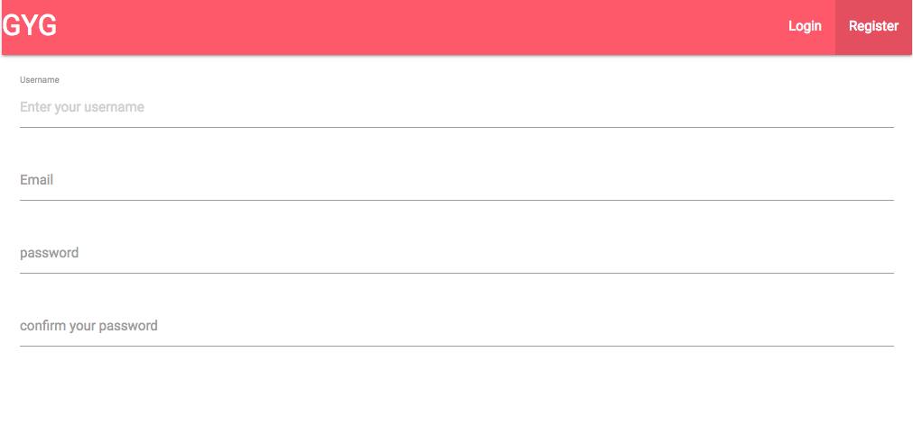
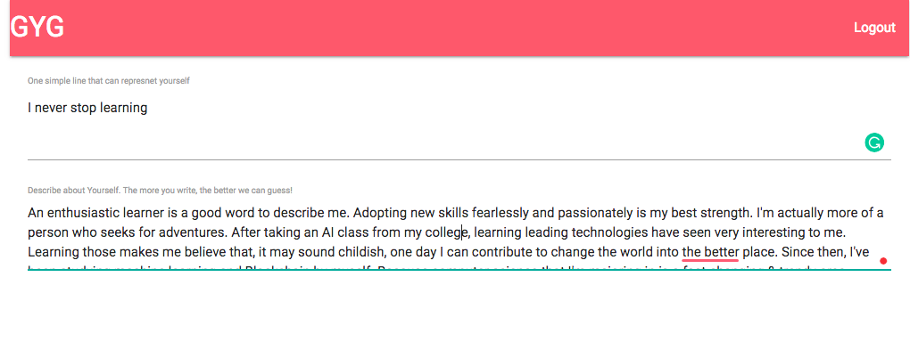
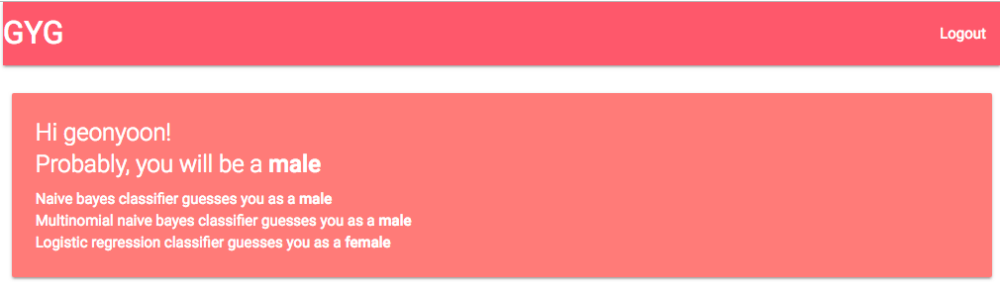
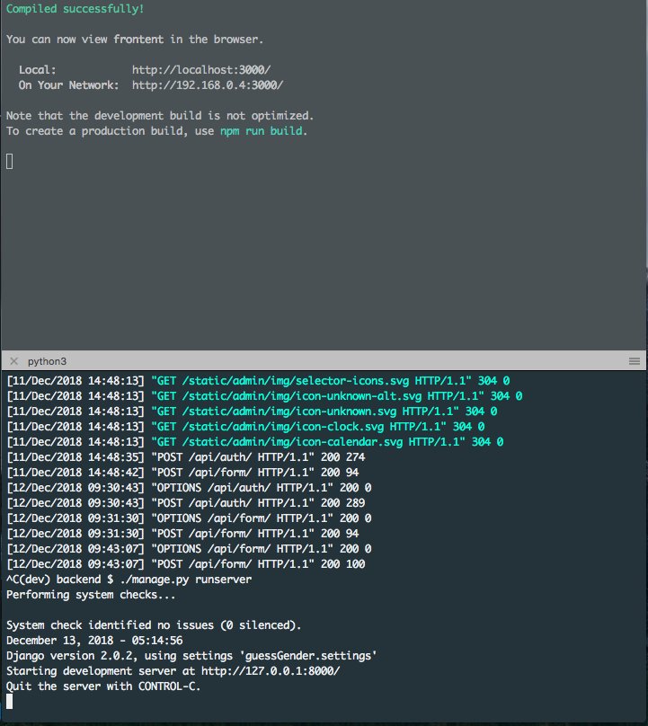

# Guess  Gender
<p float="left">
  
</p>


This is a web application using React.js and Django. 
It has an authentication system that allows you to sign in & log in. 
Using private routers restricts unauthenticated users to go to the private pages. Based on the text given by users, this app guesses their genders. Three different classifications( Naive Bayes Classifier, Multinomial Naive Bayes classifier, Logistic regression classifier) are used to study Twitter profile information and the most common guess is used for the final guess. 


## How To install

Clone the repository first
```
git clone https://github.com/GeonYoon/django-rest.git
```

### Frontend Configuration

```
cd frontend
npm install 
npm start 
```

### Backend Configuration

Make sure you have following software installed in your system. 
* Python3
* pip3

I highly encourage you to install the virutal environment so that you can create an independent environment
for this project. This can keep you out from affecting other projects by installing anything for this. 
```
pip3 install virtualenv 
```
Create virtual environment on the same dir where this project root folder is located at. 
Activate the environment
```
virtualenv -p python3 [envname]
source [envname]/bin/activate 
```
Install all the dependencies for the project.
```
cd backend
pip install -r requirements.txt
```

Create your own super user for /admin
```
python manage.py makemigrations
python manage.py migrate
python manage.py createsuperuser 
```

Run server with following line
```
python3 manage.py runserver
```


## Built With

* [Django](https://www.djangoproject.com) - Python Web framework
* [Django REST framework](https://www.django-rest-framework.org) - To handle API requests
* [React](https://reactjs.org/) - Used to build client side
* [Redux](http://redux.js.org/docs/basics/UsageWithReact.html) - Predictable state container for JavaScript apps
* [Pickle](https://docs.python.org/3/library/pickle.html) - The pickle module implements binary protocols for serializing and de-serializing a Python object structure.
* [Joblib](https://pypi.org/project/joblib/) - Joblib is a set of tools to provide lightweight pipelining in Python

## Authors
* **Geon Yoon ** - *Initial work* - [GeonYoon](https://github.com/GeonYoon)