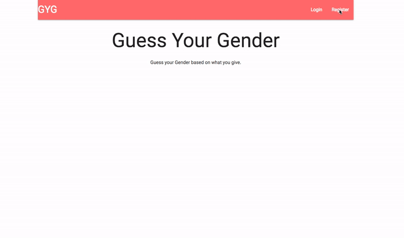

# Guess  Gender No registration version

Based on the text given by users, this app guesses their genders. Three different classifications are used to study Twitter's profile information. The studied model will predict the gender using the given inputs



## Notable features
- Machine learning model guesses users' gender 
- Naive Bayes Classifier, Multinomial Naive Bayes classifier, Logistic regression classifier are used to train the model 
- Support full authentication system 
- Private router restricts unauthenticated users to go to the private pages
- React and Django are used

## How To install
Clone the repository first
```
https://github.com/GeonYoon/guessGender.git
```

### Frontend Configuration
```
cd frontend
npm install 
npm start 
```

### Backend Configuration
Make sure you have following software installed in your system. 
* Python3
* pip3

I highly encourage you to install the virutal environment so that you can create an independent environment
for this project. This can keep you out from affecting other projects by installing anything for this. 
```
pip3 install virtualenv 
```
Create virtual environment on the same dir where this project root folder is located at. 
Activate the environment
```
virtualenv -p python3 [envname]
source [envname]/bin/activate 
```
Install all the dependencies for the project.
```
cd backend
pip install -r requirements.txt
```
Migrate all the changes
```
python manage.py makemigrations
python manage.py migrate
```
Create your own super user.
```
python manage.py createsuperuser
```
Run server with following line
```
python3 manage.py runserver
```

## Built With

* [Django](https://www.djangoproject.com) - Python Web framework
* [Django REST framework](https://www.django-rest-framework.org) - To handle API requests
* [React](https://reactjs.org/) - Used to build client side
* [Redux](http://redux.js.org/docs/basics/UsageWithReact.html) - Predictable state container for JavaScript apps
* [Pickle](https://docs.python.org/3/library/pickle.html) - The pickle module implements binary protocols for serializing and de-serializing a Python object structure.
* [Joblib](https://pypi.org/project/joblib/) - Joblib is a set of tools to provide lightweight pipelining in Python

## Authors
* **Geon Yoon ** - *Initial work* - [GeonYoon](https://github.com/GeonYoon)
